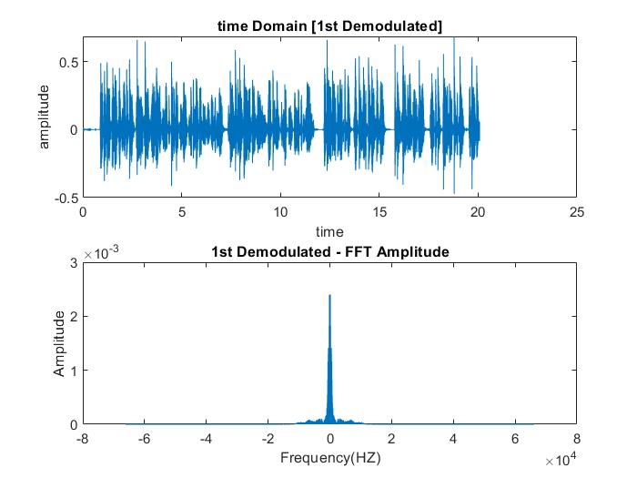
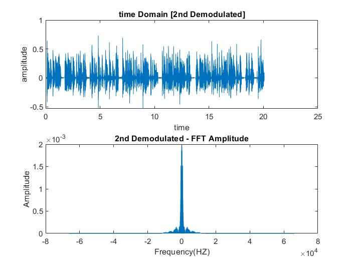
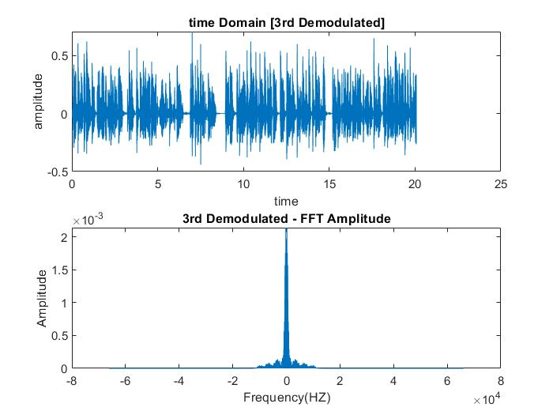
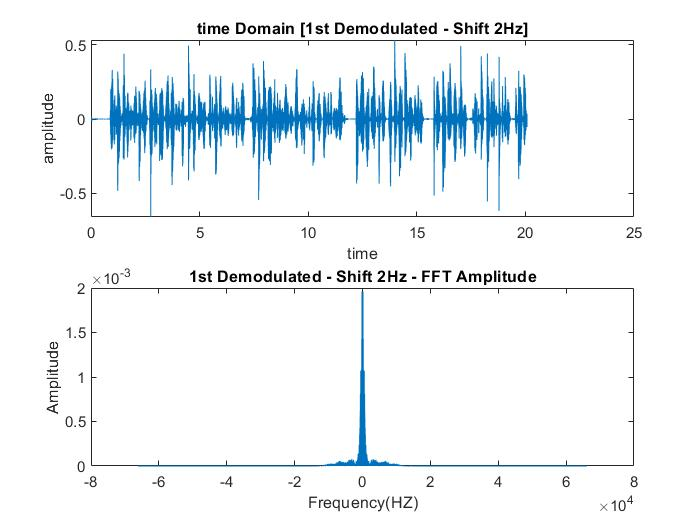
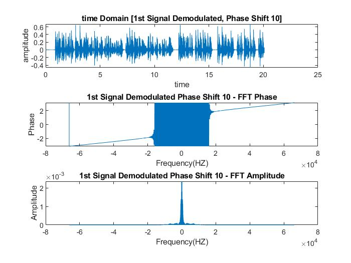
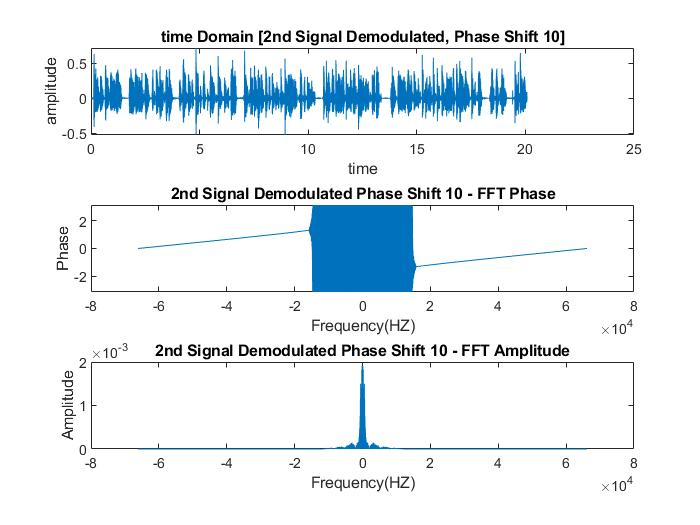
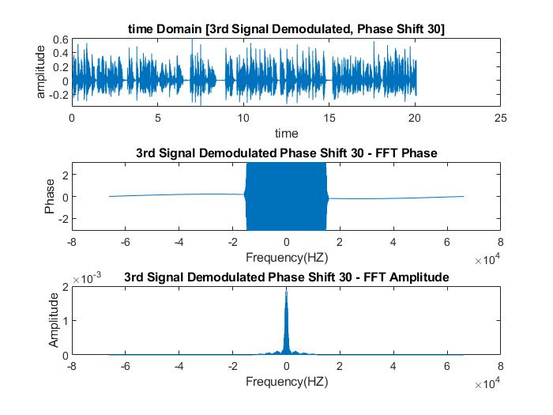
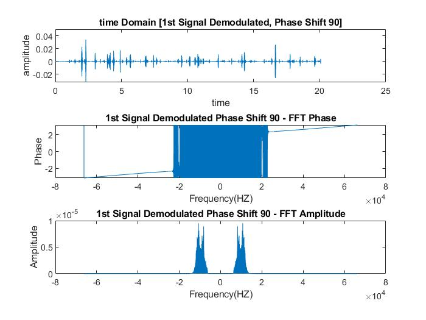
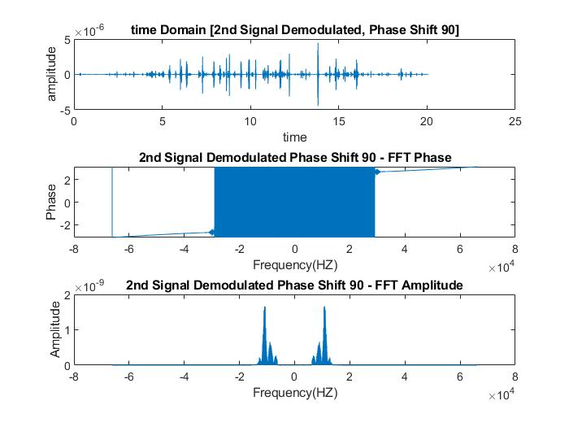
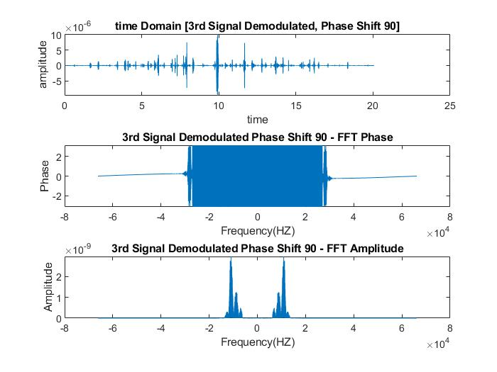

# Frequency-Division-Multiplexing
Matlab script to simulate the communication preoccess of transmitting receiving signals via modulation and demodulation

## Normal Demodulation

## Demodulation with Frequency Shift (1st signal only)

### frequency_shift = 2 HZ

### frequency_shift = 10 HZ

## Demodulation with Phase Shift

### phase_shift = 10 degree

### phase_shift = 30 degree

### phase_shift = 90 degree

